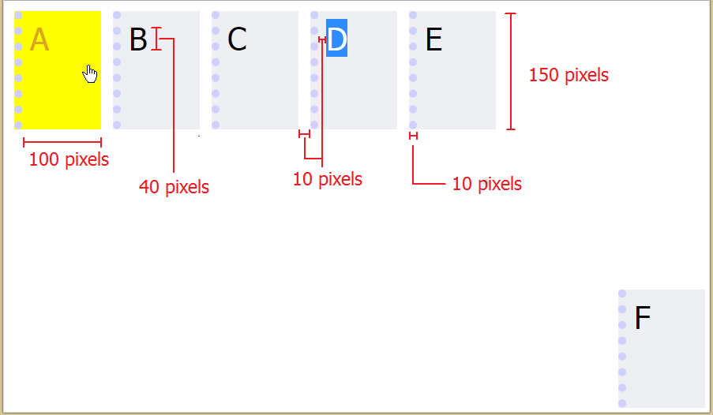

## Problem 1 (20 points)
Create a single HTML document that presents two different appearances, determined by the document's CSS stylesheet. Your HTML file should be called `index.html` and the document's title should be “CS142 Project #1”. Along with this HTML document, you should also create two stylesheets called `styleA.css` and `styleB.css`.

If the HTML file links to styleA.css then it should appear like this ("Version A"):

Problem 1 Version A
If the HTML file links to styleB.css then it should appear like this ("Version B"):

Note: The D in the screenshot is highlighted to show you what space the text should occupy. Your solution should not style the D with a blue background.

Problem 1 Version B
### Style A Specifications

- [x] There should be six box elements, lined up vertically.
- [x] All boxes are centered horizontally and equally spaced vertically. When the browser window is resized, the spacing between the boxes should change (they should be equally spaced vertically across the page). However, the boxes themselves should never overlap or change size.
- [x] Each box is `100x100` pixels, with a 1px line (color: `#687291`) on top. Text is centered horizontally.
- [x] Boxes alternate colors (colors: `#dfe1e7`, `#eeeff2`).
- [x] The final element (color: `#687291`) has a 4px, black border and the text is centered vertically.
- [x] The font in all elements is Tahoma, `40` pixels.

### Style B Specifications

- [x] Five box elements, lined up horizontally in the top left corner.
- [x] Boxes do not wrap with window resizing (i.e. Boxes A through E should stay on the same line even if your browser window is too small to display them all).
- [x] The last box is positioned in the bottom right corner of the window and stays there even when the window resizes.
- [x] Each box is `100x150` pixels (color: `#eeeff2`), with a 10px dotted line (color: `#D0D0FF`) on the left. Boxes are separated by `10` pixels of space.
- [x] When hovering over an box, the cursor changes to a hand and the box and font colors change (colors: `yellow`, `goldenrod`, `respectively`).
- [x] The font in all elements is Tahoma, `40` pixels.
- [x] There are `10` pixels of space between the letters and the edge of the box.
- [x] If a property is not outlined in these specifications (e.g. space between elements in style B and edge of window) you should choose something reasonable.

### Style Points (5 points)
Your HTML file must be a valid XHTML 1.0 document that passes validation at http://validator.w3.org. In addition, your HTML and CSS must be clean, readable, properly indented, and well-structured.

### Extra Credit (2 points)
Create a third stylesheet styleC.css that utilizes 2 of the following:

- [ ] gradients
- [ ] transitions
- [ ] animations
- [ ] web fonts
- [ ] shadows
